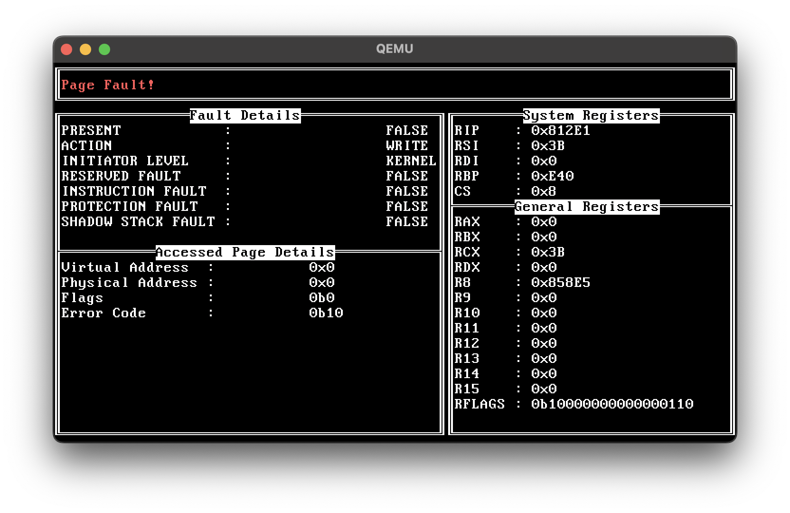
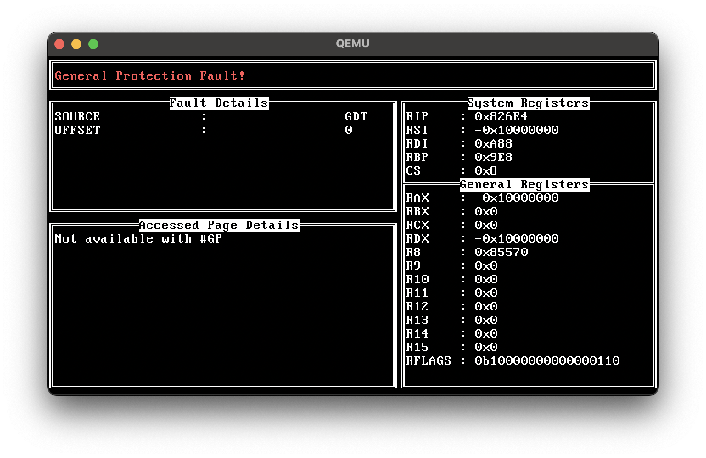
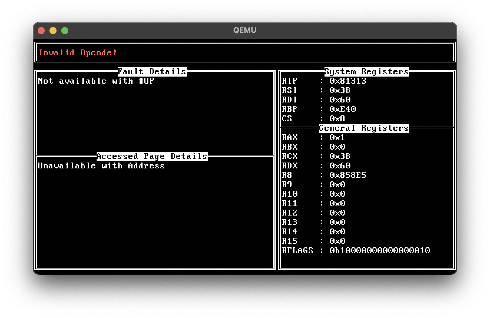
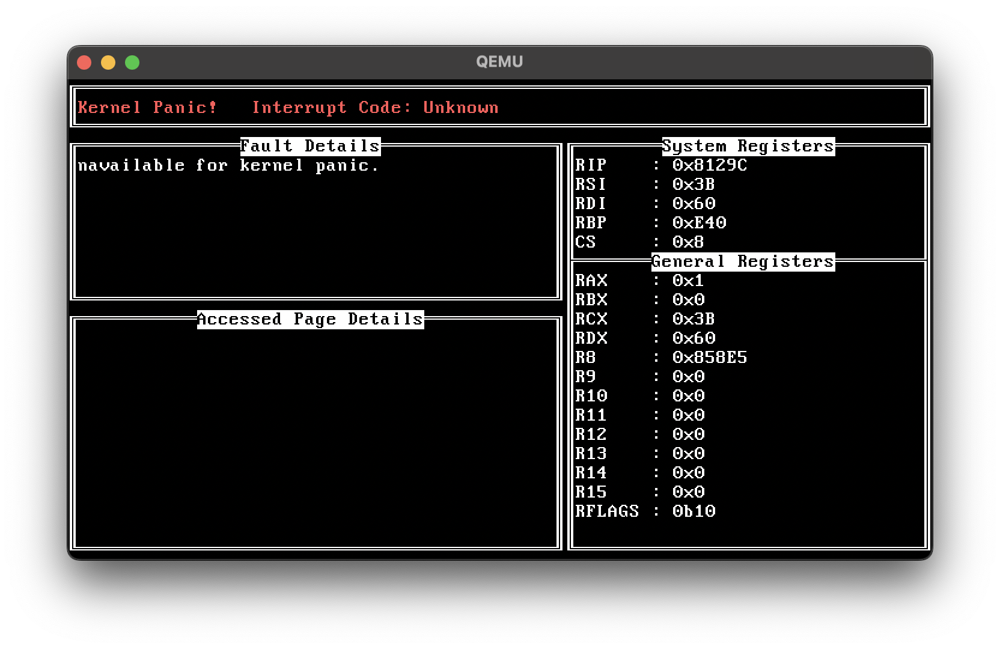

# ChudOS Manual
---
ChudOS is a small hobby kernel I've been working on for the past 2 months.
This manual contains technical explanations of the OS and how it works. Please note that you need a decent grip on the principles of computer science to understand this at all (What an OS is, different CPU architectures, pointers, etc.). I hope I've written it to where if you understand that, you wont necessarily need to 
# 1.0 Specifications
## 1.1 Architecture
ChudOS runs on x86-64 Intel and AMD CPU's. It makes use of the legacy BIOS
## 1.2 RAM
ChudOS uses 4 level paging1, 2 and currently supports 256 MiB of Virtual RAM, and does not check for the amount of physical RAM.
# 2.0 OS components
## 2.1 Bootloader
This project uses a non standard version of a bootloader, normally bootloaders are in 2 stages where the first loads the second and the second does complex tasks. This bootloader uses 3 stages of execution.
### 2.1.1 Bootloader Stage 1
The purpose of the first stage of the bootloader is simply to load the second stage. Since the BIOS only loads the first 512 bytes of the disk for the bootloader, and the second stage of the bootloader is a LOT more than that, it must load it.10
### 2.1.2 Bootloader Stage 2
The purpose of the second stage of the bootloader is to prepare the protected mode environment for the 3rd stage. See source 13 for explanation on protected mode.
### 2.1.3 Bootloader Stage 3
The purpose of the third stage of the bootloader is to prepare the long mode environment for the kernel and set up level 4 paging. See sources 2 and 15 for an explanation on level 4 paging and long mode.
## 2.2 Kernel
Currently, the kernel can do like 10 things. 
1. Print VGA text to the screen through VGA.h
2. Use a primitve formatter for printing (supports \n, \t, \b, and wrapping) through std.h.
3. Convert integers to char arrays in three formats (binary, decimal, and hexidecimal) through std.h.
4. Use keyboard interrupts.
5. Use timer interrupts.
6. Handle page faults and exception faults. (Exceptions.h)
7. Properly panics when an issue can't be resolved. (KernelPanic.h)
8. Set up the PIC. (PIC.h)
9. Map memory through various structs. (Memory.h)
10. Do a VERY simple syscall. (syscall.h)

I wrote this off the top of my head so be weary.
# 3.0 Building, Running, and Debugging
## 3.1 Requirements
In order to properly run/build ChudOS, you must install the following packages through a package manager of your choice. (apt for Ubuntu/Debian, pacman for Arch Linux, homebrew for Mac).
1. NASM (Netwide Assembler) | sudo apt install nasm/sudo pacman -S nasm/brew install nasm
2. x86_64-elf-gcc (For compiling C++ code) | brew install x86_64-elf-gcc (only available prebuilt through homebrew)
3. x86_64-elf-ld (For linking C++ code) | brew install x86_64-elf-ld (only available prebuilt through homebrew)
4. qemu-system-x86_64 (For running the OS) | sudo apt install qemu-system-x86_64/sudo pacman -S qemu/brew install qemu-system-x86_64
5. make (For automating assembling/compiling/linking) | sudo apt install make/sudo pacman -S make/brew install make

## 3.2 Optional Software
If you plan to edit the OS's source code or debug the OS in any way, I recommend combining the qemu.log with ImHex or any other hex editor for debugging, I use ImHex because it has a built in disassembler for seeing exactly which instruction caused an error. For editing the source code, I just use visual studio code since it has an easy to use GUI, but if you plan to edit the system through the CLI, just use nano, it comes pre-installed on every linux distribution and MacOS version.

## 3.3 Building
To build OS, simply run the 'make' command while in the projects main directory, the kernel image will be located at 'bin/ChudOS.img'.

## 3.4 Running
To run the OS, simply build it and then run one of the below commands.
For general use:
> qemu-system-x86_64 -drive format=raw,file=bin/ChudOS.img -boot c -no-reboot -monitor stdio -device VGA,vgamem_mb=3
For debugging:
> qemu-system-x86_64 -drive format=raw,file=bin/ChudOS.img -boot c -no-reboot -d int,in_asm -D qemu.log -monitor stdio -device VGA,vgamem_mb=3
If you do debugging, a log of every instruction and interrupt that is generated by QEMU will be put into 'qemu.log'

## 3.5 Debugging
Below is some basic information for debugging using a hex editor and how to read debug screens.

### 3.5.1 Reading Debug Screens
Upon a CPU exception, the kernel will display an error screen specified to the exception, if a debug screen for an exception is not yet implemented, then it will display a kernel panic along with the exception number.
Implemented exceptions:
1. Page Fault (#PF)
2. General Protection Fault (#GF)
3. Invalid Opcode (#UP)
4. Kernel Panic (for exceptions which don't have a debug screen)
Screenshots of debug screens:

1. #PF

2. #GF

3. #UD

4. Kernel Panic

You can force these exceptions to occur through the following shortcuts
1. Press CTRL+ALT+TAB to force a page fault
2. Press CTRL+ALT+ESC to force a kernel panic
3. Press CTRL+ALT+LSHIFT to force an Invalid Opcode fault
4. Press CTRL+ALT+BACKSPACE to force a general protection fault

These shortcuts are also displayed at boot.

### 3.5.2 Getting the address of an instruction
The kernel's code is loaded at physical address 0x70000, however, its position on the hard drive is 0x32000.
Due to this, if you want to find out what instruction is printed

# 4.0 Roadmap
In the future I plan to finish the following files:
1. PCI.h/PCI.cpu | The PCI slots
2. AHCI.h/AHCI.cpu | The hard drive controller
3. Tasks.h/Tasks.cpp | The task manager (reports on C)
4. Timer.h/Timer.cpp | The scheduler

Along with this, I plan to create some new additions!
1. A file manager API
2. A shell (with support for .sh files)
3. Basic CLI applications based on the GNU library
4. Expanded syscalls
5. A standard library for user applications

And don't worry, the kernel will eventually be stabilized.
# 5.0 Sources
The below contain all sources used for this project.
1. “Intel® 64 and IA-32 Architectures Software Developer Manuals.” Intel, www.intel.com/content/www/us/en/developer/articles/technical/intel-sdm.html.
2. “Paging ” OSDev Wiki, wiki.osdev.org/Paging.
3. "PCI" OSDev Wiki, wiki.osdev.org/PCI#The_PCI_Bus.
4. "PCI" UC Irvine, ics.uci.edu/~iharris/ics216/pci/PCI_22.pdf.
5. "NVME" OSDev Wiki, wiki.osdev.org/NVMe#Overview
6. "Memory Mapped Registers in C/C++." OSDev Wiki, https://wiki.osdev.org/Memory_mapped_registers_in_C/C++
7. "PCI Express" OSDev Wiki, wiki.osdev.org/PCI_Express.
8. "SATA" OSDev Wiki, wiki.osdev.org/SATA
9. "AHCI" OSDev Wiki, wiki.osdev.org/AHCI
10. "Project 4: Writing a Bootloader from Scratch" Carnegie Mellon University, www.cs.cmu.edu/~410-s07/p4/p4-boot.pdf.
11. "Detecting Memory (x86)" OSDev Wiki, wiki.osdev.org/Detecting_Memory_(x86)
12. "VESA Bios Extension (VBE) Core Functions Standard Version 2.0" Video Electronics Standard Association, www.phatcode.net/res/221/files/vbe20.pdf.
13. "Bootloader" Wikipeida, en.wikipedia.org/wiki/Bootloader.
14. "Protected Mode" OSDev Wiki, wiki.osdev.org/Protected_Mode
15. "Setting Up Long Mode" OSDev Wiki, wiki.osdev.org/Setting_Up_Long_Mode
16. "PS/2 Keyboard" OSDev Wiki, wiki.osdev.org/PS/2_Keyboard#Scan_Code_Set_1